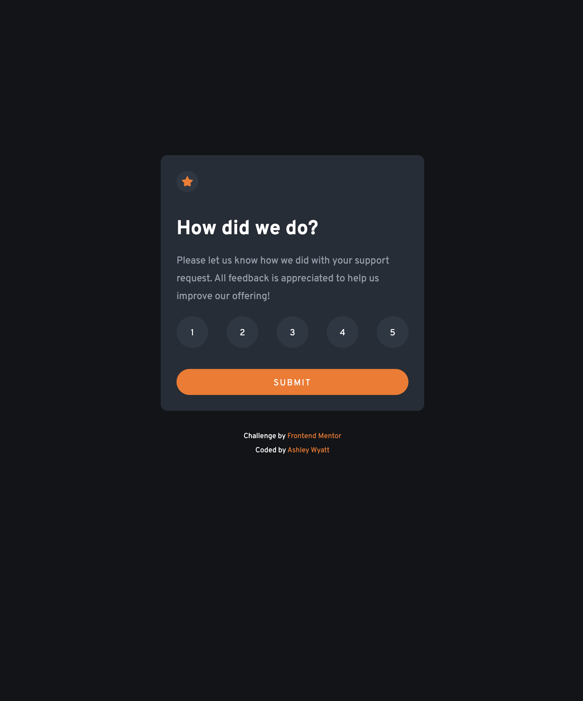

# Frontend Mentor - Interactive rating component solution

This is a solution to the [Interactive rating component challenge on Frontend Mentor](https://www.frontendmentor.io/challenges/interactive-rating-component-koxpeBUmI). Frontend Mentor challenges help you improve your coding skills by building realistic projects. 

## Table of contents

- #overview 
  - #the-challenge is to create an interactive rating component that allows the user to submit a rating from 1-5, and a pop up saying thank you with their rating will show up afterwards. Javascript will be used to display the hidden pop up message when it is clicked. JS will also be used to make sure that the number that is selected, is added to the next screen to fill in "You selected X out of 5". 
  - [Screenshot](#screenshot)
  - [Links](#links)
- [My process](#my-process)
  - [Built with](#built-with)
  - [What I learned](#what-i-learned)
  - [Continued development](#continued-development)
  - [Useful resources](#useful-resources)
- [Author](#author)
- [Acknowledgments](#acknowledgments)


## Overview

### The challenge

Users should be able to:

- View the optimal layout for the app depending on their device's screen size
- See hover states for all interactive elements on the page
- Select and submit a number rating
- See the "Thank you" card state after submitting a rating

### Screenshot




### Links

- Live Site URL: incredible-zabaione-05e9b9.netlify.app

## My process

### Built with

- Semantic HTML5 markup
- CSS custom properties
- Flexbox
- CSS Grid
- JavaScript

### What I learned
With this challenge I learned a new way to use the span tag in order to have it interact with JS, to display the specific number the user selects on the "Thank you" page. See example of my code below: 
```
<div class="thank-you hidden">
    
    <p class="gray">You Selected <span id="rating">5</span> out of 5</p>
    <h2>Thank you!</h2>
    <p>We appreciate you taking the time to give a rating. If you ever need more support, don't hesitate to reach out!</p>
    <button class="btn-submit" id="rate-again">Rate Again</button>
  </div>

```


This helped me solidify my knowledge on Flex box, selecting multiple elements in css, and utilizing cursor with the value of pointer. See below for an example of my code: 
```
.pop-up-box ul li button {
    width: 3rem;
    height: 3rem;
    border: none;
    background-color: hsl(213, 20%, 22%);
    color: white;
    padding-top: 0.2rem;
    border-radius: 50%;
    cursor: pointer;
    transition: 0.3s;
}
```
Another thing I was able to solidify more was using Event Listener for specific actions performed by the user. See example below:
```
submitButton.addEventListener("click", () => {
   thanksContainer.classList.remove("hidden")
   popUpBox.style.display = "none"
})
```


